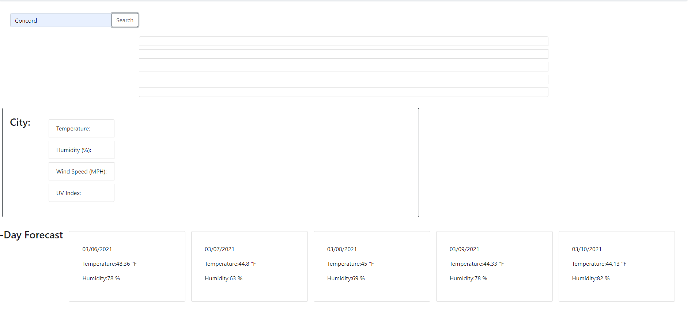

# Weather Api

- Weather Dashboard is an application to find weather conditions of given city and 5 day forecast.
- Used server side API to retrieve the weather data

## Table of contentens

- [Description](#Description)
- [Links](#Links)
- [Resources](#Resources)
- [Screenshot](#Screenshot)

## Description

- It displays Date, Icon Image, Temperature, Humidity, Wind Speeds, UV index and any city!

```
GIVEN a weather dashboard with form inputs
WHEN I search for a city
THEN I am presented with current and future conditions for that city and that city is added to the search history
WHEN I view current weather conditions for that city
THEN I am presented with the city name, the date, an icon representation of weather conditions, the temperature, the humidity, the wind speed, and the UV index
WHEN I view the UV index
THEN I am presented with a color that indicates whether the conditions are favorable, moderate, or severe
WHEN I view future weather conditions for that city
THEN I am presented with a 5-day forecast that displays the date, an icon representation of weather conditions, the temperature, and the humidity
WHEN I click on a city in the search history
THEN I am again presented with current and future conditions for that city
```

## Links

- Link to Github Repository: https://github.com/urielrosario/Weather-api.git

- Link to deployed website: https://urielrosario.github.io/Weather-api/

## Resources

- https://stackoverflow.com/questions/44177417/
- https://getbootstrap.com/docs/5.0/getting-started/introduction/
- https://developer.mozilla.org/en-US/
- https://www.w3schools.com/
- Bootcamp assignments

## Screenshot


